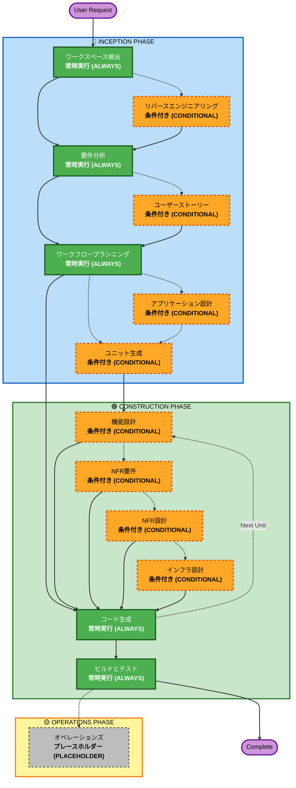

# AI-DLC 適応型ワークフロー概要

**目的**: AI モデルおよび開発者がワークフロー全体の構造を理解するための技術リファレンス。

**注意**: 類似した内容が `welcome-message.md` (ユーザー向けウェルカムメッセージ) および `README.md` (ドキュメント) にも存在します。この重複は意図的なものです。各ファイルは異なる目的を持っています:
- **このファイル**: AI モデルのコンテキスト読み込み用の Mermaid ダイアグラムを含む詳細な技術リファレンス
- **welcome-message.md**: ASCII ダイアグラムを含むユーザー向けウェルカムメッセージ
- **README.md**: リポジトリ向けの人間が読みやすいドキュメント

## 3フェーズのライフサイクル:
• **インセプション・フェーズ (INCEPTION PHASE)**: 計画とアーキテクチャ (ワークスペース検出 + 条件付きフェーズ + ワークフロープランニング)
• **コンストラクション・フェーズ (CONSTRUCTION PHASE)**: 設計、実装、ビルドとテスト (ユニットごとの設計 + コード生成 + ビルドとテスト)
• **オペレーションズ・フェーズ (OPERATIONS PHASE)**: 将来のデプロイとモニタリングワークフローのプレースホルダー (PLACEHOLDER)

## 適応型ワークフローの流れ:
• **ワークスペース検出 (Workspace Detection)** (常時) → **リバースエンジニアリング (Reverse Engineering)** (ブラウンフィールド (Brownfield) のみ) → **要件分析 (Requirements Analysis)** (常時、適応的な深度) → **条件付きフェーズ** (必要に応じて) → **ワークフロープランニング (Workflow Planning)** (常時) → **コード生成 (Code Generation)** (常時、ユニットごと) → **ビルドとテスト (Build and Test)** (常時)

## 仕組み:
• **AI がリクエスト、ワークスペース、複雑さを分析**して、どのステージが必要かを判断する
• **常時実行されるステージ**: ワークスペース検出 (Workspace Detection)、要件分析 (Requirements Analysis) (適応的な深度)、ワークフロープランニング (Workflow Planning)、コード生成 (Code Generation) (ユニットごと)、ビルドとテスト (Build and Test)
• **その他すべては条件付き (CONDITIONAL)**: リバースエンジニアリング (Reverse Engineering)、ユーザーストーリー (User Stories)、アプリケーション設計 (Application Design)、ユニット生成 (Units Generation)、ユニットごとの設計ステージ (機能設計 (Functional Design)、NFR要件 (NFR Requirements)、NFR設計 (NFR Design)、インフラ設計 (Infrastructure Design))
• **固定されたシーケンスはない**: ステージは特定のタスクに対して最も合理的な順序で実行される

## チームの役割:
• **質問ファイルへの回答**: `[Answer]:` タグとアルファベット選択肢 (A, B, C, D, E) を使用して専用の質問ファイルに回答する
• **選択肢 E が利用可能**: 提供された選択肢が合わない場合は「その他 (Other)」を選択し、カスタム回答を記述する
• **チームとして協力**して各フェーズをレビューし、次に進む前に承認する
• **アーキテクチャアプローチについてチームで決定**する
• **重要**: これはチームの取り組みであり、各フェーズに関連するステークホルダーを巻き込むこと

## AI-DLC 3フェーズワークフロー:

**ステージの説明:**

**🔵 インセプション・フェーズ (INCEPTION PHASE)** - 計画とアーキテクチャ
- ワークスペース検出 (Workspace Detection): ワークスペースの状態とプロジェクトタイプの分析 (常時 (ALWAYS))
- リバースエンジニアリング (Reverse Engineering): 既存コードベースの分析 (条件付き (CONDITIONAL) - ブラウンフィールド (Brownfield) のみ)
- 要件分析 (Requirements Analysis): 要件の収集と検証 (常時 (ALWAYS) - 適応的な深度)
- ユーザーストーリー (User Stories): ユーザーストーリーとペルソナの作成 (条件付き (CONDITIONAL))
- ワークフロープランニング (Workflow Planning): 実行計画の作成 (常時 (ALWAYS))
- アプリケーション設計 (Application Design): 高レベルなコンポーネント識別とサービス層の設計 (条件付き (CONDITIONAL))
- ユニット生成 (Units Generation): ユニット・オブ・ワーク (unit of work) への分解 (条件付き (CONDITIONAL))

**🟢 コンストラクション・フェーズ (CONSTRUCTION PHASE)** - 設計、実装、ビルドとテスト
- 機能設計 (Functional Design): ユニットごとの詳細なビジネスロジック設計 (条件付き (CONDITIONAL)、ユニットごと)
- NFR要件 (NFR Requirements): NFR の決定とテックスタックの選定 (条件付き (CONDITIONAL)、ユニットごと)
- NFR設計 (NFR Design): NFR パターンと論理コンポーネントの組み込み (条件付き (CONDITIONAL)、ユニットごと)
- インフラ設計 (Infrastructure Design): 実際のインフラサービスへのマッピング (条件付き (CONDITIONAL)、ユニットごと)
- コード生成 (Code Generation): パート1 - 計画、パート2 - 生成によるコード生成 (常時 (ALWAYS)、ユニットごと)
- ビルドとテスト (Build and Test): 全ユニットのビルドと包括的なテストの実行 (常時 (ALWAYS))

**🟡 オペレーションズ・フェーズ (OPERATIONS PHASE)** - プレースホルダー (PLACEHOLDER)
- オペレーションズ (Operations): 将来のデプロイとモニタリングワークフローのプレースホルダー (PLACEHOLDER)

**主要な原則:**
- フェーズは価値を追加する場合にのみ実行される
- 各フェーズは独立して評価される
- インセプション・フェーズ (INCEPTION PHASE) は「何を」「なぜ」に焦点を当てる
- コンストラクション・フェーズ (CONSTRUCTION PHASE) は「どのように」とビルドとテストに焦点を当てる
- オペレーションズ・フェーズ (OPERATIONS PHASE) は将来の拡張のためのプレースホルダー (PLACEHOLDER)
- シンプルな変更では条件付き (CONDITIONAL) インセプションステージをスキップできる
- 複雑な変更ではインセプション・フェーズ (INCEPTION PHASE) とコンストラクション・フェーズ (CONSTRUCTION PHASE) を完全に実行する
