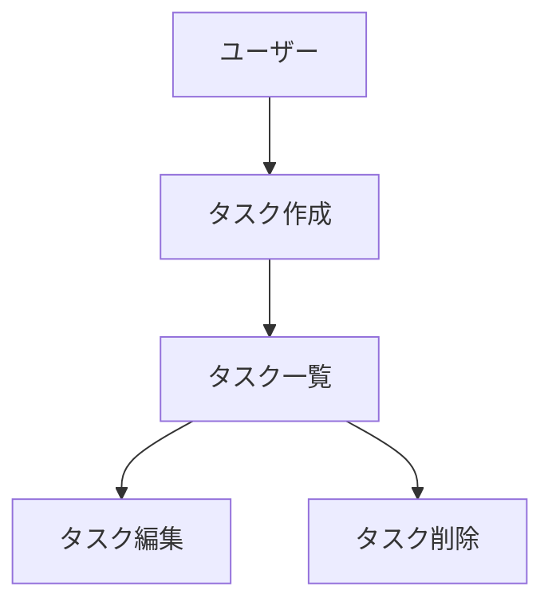

# 初回プロジェクトセットアップ

このコマンドは、新規プロジェクトの初回セットアップを実行します。
以下の手順に従って、永続的ドキュメントとステアリングファイルを作成してください。

## ドキュメント分類

### 1. 永続的ドキュメント (docs/permanent/)
アプリケーション全体の「何を作るか」「どう作るか」を定義する恒久的なドキュメント。
アプリケーションの基本設計や方針が変わらない限り更新されません。

- **product-requirements.md** - プロダクト要求定義書
   - プロダクトビジョンと目的
   - ターゲットユーザーと課題・ニーズ
   - 主要な機能一覧
   - 成功の定義
   - ビジネス要件
   - ユーザーストーリー
   - 受け入れ条件
   - 機能要件
   - 非機能要件

- **functional-design.md** - 機能設計書
   - 機能ごとのアーキテクチャ
   - システム構成図
   - データモデル定義 (ER図含む)
   - コンポーネント設計
   - ユースケース図、画面遷移図、ワイヤフレーム
   - API設計 (将来的にバックエンドと連携する場合)

- **architecture.md** - 技術仕様書
   - テクノロジースタック
   - 開発ツールと手法
   - 技術的制約と要件
   - パフォーマンス要件

- **repository-structure.md** - リポジトリ構造定義書
   - フォルダ・ファイル構成
   - ディレクトリの役割
   - ファイル配置ルール

- **development-guidelines.md** - 開発ガイドライン
   - コーディング規約
   - 命名規則
   - スタイリング規約
   - テスト規約
   - Git規約

- **glossary.md** - ユビキタス言語定義
   - ドメイン用語の定義
   - ビジネス用語の定義
   - UI/UX用語の定義
   - 英語・日本語対応表
   - コード上の命名規則

### 2. 作業単位のドキュメント (.steering/[YYYYMMDD]-[開発タイトル]/)
特定の開発作業における「今回何をするか」を定義する一時的なステアリングファイル。
作業完了後は参照用として保持されますが、新しい作業では新しいディレクトリを作成します。

- **requirements.md** - 今回の作業の要求内容
   - 変更・追加する機能の説明
   - ユーザーストーリー
   - 受け入れ条件
   - 制約事項

- **design.md** - 変更内容の設計
   - 実装アプローチ
   - 変更するコンポーネント
   - データ構造の変更
   - 影響範囲の分析

- **tasklist.md** - タスクリスト
   - 具体的な実装タスク
   - タスクの進捗状況
   - 完了条件

## セットアップ手順

### ステップ1: フォルダ作成
```bash
mkdir -p docs
mkdir -p .steering
```

### ステップ2: 永続的ドキュメント作成 (docs/permanent/)
アプリケーション全体の設計を定義します。
各ドキュメントを作成後、必ず確認・承認を得てから次に進みます。

1. `docs/permanent/product-requirements.md` - プロダクト要求定義書
2. `docs/permanent/functional-design.md` - 機能設計書
3. `docs/permanent/architecture.md` - 技術仕様書
4. `docs/permanent/repository-structure.md` - リポジトリ構造定義書
5. `docs/permanent/development-guidelines.md` - 開発ガイドライン
6. `docs/permanent/glossary.md` - ユビキタス言語定義

**重要**: 1ファイルごとに作成後、必ず確認・承認を得てから次のファイル作成を行う

### ステップ3: 初回実装用のステアリングファイル作成
初回実装用のディレクトリを作成し、実装に必要なドキュメントを配置します。
```bash
mkdir -p .steering/[YYYYMMDD]-initial-implementation
```

作成するドキュメント:

1. `.steering/[YYYYMMDD]-initial-implementation/requirements.md` - 初回実装の要求
2. `.steering/[YYYYMMDD]-initial-implementation/design.md` - 実装設計
3. `.steering/[YYYYMMDD]-initial-implementation/tasklist.md` - 実装タスク

**重要**: 1ファイルごとに作成後、必ず確認・承認を得てから次のファイル作成を行う

## 図表・ダイアグラムの記載ルール
設計図やダイアグラムは、関連する永続的ドキュメント内に直接記載します。
独立した diagrams フォルダは作成せず、手間を最小限に抑えます。

**配置例:**
- ER図、データモデル図 → `functional-design.md` 内に記載
- ユースケース図 → `functional-design.md` または `product-requirements.md` 内に記載
- 画面遷移図、ワイヤフレーム → `functional-design.md` 内に記載
- システム構成図 → `functional-design.md` または `architecture.md` 内に記載

### 記述形式
### 記述形式
1. Mermaid記法 (推奨)
   - Markdownに直接埋め込める
   - バージョン管理が容易
   - ツール不要で編集可能



2. ASCII アート
   - シンプルな図表に使用
   - テキストエディタで編集可能

```
+----------+
|  Header  |
+----------+
     |
     v
+-----------+
| Task List |
+-----------+
```

3. 画像ファイル (必要な場合のみ)
   - 複雑なワイヤフレームやモックアップ
   - docs/images/ フォルダに配置
   - PNG または SVG 形式を推奨
