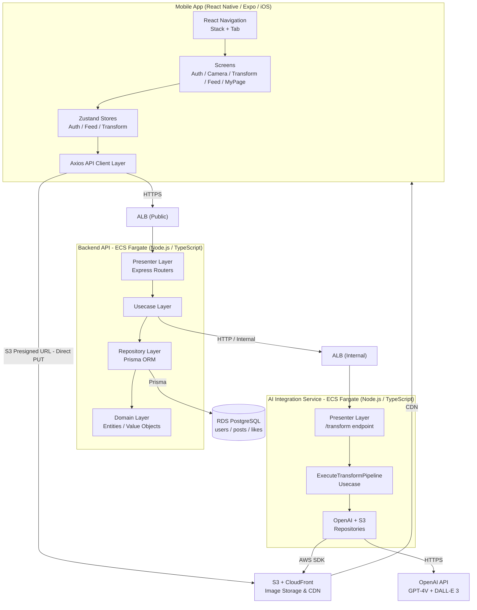

# Application Design — Refactor the World (RTW) MVP

## システムアーキテクチャ概要



### テキスト代替（フォールバック）
```
Mobile App (React Native/iOS)
  ├── Screens (Auth/Camera/Transform/Feed/MyPage)
  ├── Zustand Stores (Auth/Feed/Transform)
  ├── Axios API Client Layer
  └── React Navigation (Stack + Tab)
       │ HTTPS → ALB (Public)
       ▼
Backend API - ECS Fargate (Node.js/TypeScript) [DDD]
  ├── Presenter Layer (Express Routers)
  ├── Usecase Layer
  ├── Repository Layer (Prisma ORM)
  └── Domain Layer (Entities)
       │ Prisma → RDS PostgreSQL
       │ HTTP (internal) → ALB (Internal)
       ▼
AI Integration Service - ECS Fargate (Node.js/TypeScript) [DDD]
  ├── Presenter Layer (/transform)
  ├── ExecuteTransformPipeline Usecase
  └── OpenAI + S3 Repositories
       ├── AWS SDK → S3 + CloudFront
       └── HTTPS → OpenAI API (GPT-4V + DALL-E 3)

Mobile → S3 (Presigned URL 直接PUT)
S3 + CloudFront → Mobile (CDN画像配信)
```

---

## 設計方針サマリー

| 決定事項 | 選択 | 理由 |
|---------|------|------|
| バックエンドアーキテクチャ | DDD（Domain/Usecase/Repository/Presenter） | 長期メンテ・テスト容易性・拡張性（企業機能・ポイントシステム）を考慮 |
| AI変換パイプライン | **独立 ECS Fargate サービス** | AI処理の重さがバックエンド全体に影響しないよう分離。「短期」ダメポイント解消のためスピーディーな処理を保証 |
| バックエンドランタイム | **AWS ECS Fargate** | コールドスタートなし。フィード3秒・AI変換10秒の目標を安定達成。「短期」解消の安定性優先 |
| 画像アップロード | **S3 Presigned URL（直接アップロード）** | バックエンドに画像データを通さず高速。5秒以内目標の達成 |
| モバイル状態管理 | **Zustand** | 軽量・低ボイラープレート。MVPに適切な規模感 |
| モバイルAPIクライアント | **Axios + カスタムクライアント層** | JWT自動付与・エラーハンドリング共通化 |
| モバイルナビゲーション | **React Navigation（Stack + Tab）** | 認証フロー（Stack）とメインアプリ（Tab）の明確な分離 |
| DBアクセス | **Prisma ORM** | 型安全・スキーマ駆動開発・マイグレーション管理の一体化。MVP段階のシンプルさと将来の拡張性を両立 |

---

## ユニット構成

### Unit 1: Backend API

| 項目 | 詳細 |
|------|------|
| **ランタイム** | Node.js 20 LTS / TypeScript |
| **フレームワーク** | Express（またはFastify） |
| **アーキテクチャ** | DDD 4レイヤー（Presenter / Usecase / Repository / Domain） |
| **ORM** | Prisma |
| **デプロイ** | AWS ECS Fargate + ALB（Public） |
| **主要責務** | 認証・投稿・フィード・いいね・マイページ・Presigned URL発行・AI Serviceへの委譲 |
| **APIエンドポイント数** | 12 |

### Unit 2: AI Integration Service

| 項目 | 詳細 |
|------|------|
| **ランタイム** | Node.js 20 LTS / TypeScript |
| **アーキテクチャ** | DDD 4レイヤー（Presenter / Usecase / Repository / Domain） |
| **外部依存** | OpenAI API（GPT-4V + DALL-E 3）, AWS S3 |
| **デプロイ** | AWS ECS Fargate + ALB（Internal、Backend API からのみアクセス） |
| **主要責務** | GPT-4V解析 → DALL-E 3生成 → S3アップロードの変換パイプライン |
| **APIエンドポイント数** | 1（POST /transform） |

### Unit 3: Mobile App

| 項目 | 詳細 |
|------|------|
| **フレームワーク** | React Native / Expo（iOSビルド対応） |
| **状態管理** | Zustand |
| **HTTPクライアント** | Axios + カスタムAPIクライアント層 |
| **ナビゲーション** | React Navigation（AuthStack + MainTabNavigator） |
| **画面数** | 7（Login / Register / Camera / Transform / PostForm / Feed / MyPage） |
| **Storeコンポーネント** | 4（Auth / Feed / Transform / Post） |

### Unit 4: AWS Infrastructure

| 項目 | 詳細 |
|------|------|
| **コンピューティング** | ECS Fargate × 2（Backend API + AI Service） |
| **データベース** | RDS PostgreSQL（Multi-AZ対応オプション） |
| **ストレージ** | S3（before/after画像）+ CloudFront（CDN配信） |
| **ロードバランサー** | ALB × 2（Public: モバイル向け / Internal: AI Service向け） |
| **シークレット管理** | AWS Secrets Manager（DB接続文字列・OpenAI APIキー・JWT秘密鍵） |

---

## 主要なデータフロー（5本）

| # | フロー名 | 経路 |
|---|---------|------|
| 1 | 認証 | Mobile → Backend API → RDS |
| 2 | 画像アップロード | Mobile → Backend API（URL発行）→ Mobile → S3（直接PUT） |
| 3 | AI変換 | Mobile → Backend API → AI Service → OpenAI → S3 → Mobile |
| 4 | 投稿 | Mobile → Backend API → RDS |
| 5 | フィード/マイページ | Mobile → Backend API → RDS → CloudFront（画像配信） |

---

## 成果物一覧

| ファイル | 内容 |
|---------|------|
| `components.md` | 全コンポーネント定義（4ユニット × DDD各レイヤー） |
| `component-methods.md` | TypeScriptメソッドシグネチャ（Usecase / Repository / Store / Service） |
| `services.md` | サービス定義・オーケストレーションパターン（6サービスフロー） |
| `component-dependency.md` | 依存関係マトリクス・コンポーネント内DDD依存ルール・データフロー図 |
| `application-design.md` | 本ドキュメント（統合設計概要） |

---

## Construction フェーズへの引き継ぎ事項

Construction フェーズ（別セッション）の **Functional Design** で詳細化が必要な項目：

- `RegisterUserUsecase`: パスワード強度バリデーション・ユーザー名文字数制約
- `GetFeedUsecase`: ページネーション上限・フィードのソートロジック詳細
- `LikePostUsecase`: 重複いいね時のエラーハンドリング詳細
- `ExecuteTransformPipelineUsecase`: GPT-4Vプロンプト設計・DALL-E 3プロンプト構築ロジック・タイムアウト値
- `GeneratePresignedUrlUsecase`: Presigned URL有効期限・許可するファイルサイズ上限
- PBT適用対象（AI変換バリデーション関数）の詳細仕様
