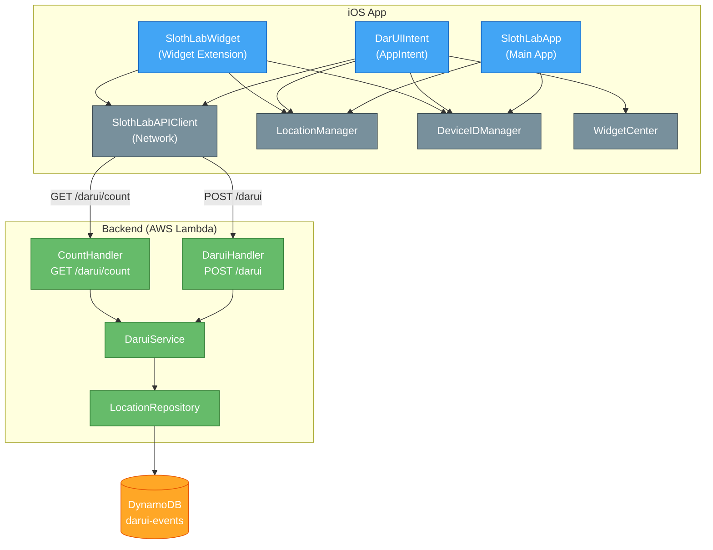

# コンポーネント依存関係 — Sloth-Lab

## 依存関係マトリクス

| コンポーネント | 依存先 | 依存タイプ |
|--------------|--------|-----------|
| SlothLabApp | LocationManager | 直接依存（初回権限取得）|
| SlothLabApp | DeviceIDManager | 直接依存（ID初期化）|
| DarUIIntent | SlothLabAPIClient | 直接依存（API呼び出し）|
| DarUIIntent | LocationManager | 直接依存（現在地取得）|
| DarUIIntent | DeviceIDManager | 直接依存（デバイスID取得）|
| DarUIIntent | WidgetCenter（WidgetKit） | 直接依存（reloadTimelines）|
| SlothLabWidget.Provider | SlothLabAPIClient | 直接依存（カウント取得）|
| SlothLabWidget.Provider | LocationManager | 直接依存（現在地取得）|
| SlothLabWidget.Provider | DeviceIDManager | 直接依存（デバイスID取得）|
| SlothLabAPIClient | DaruiHandler（HTTP） | ネットワーク依存（API Gateway）|
| SlothLabAPIClient | CountHandler（HTTP） | ネットワーク依存（API Gateway）|
| DaruiHandler | DaruiService | 直接依存 |
| CountHandler | DaruiService | 直接依存 |
| DaruiService | LocationRepository | 直接依存 |
| LocationRepository | DynamoDB（AWS SDK） | インフラ依存 |
| SlothLabStack（CDK） | DynamoDB Table | プロビジョニング |
| SlothLabStack（CDK） | DaruiHandler Lambda | プロビジョニング |
| SlothLabStack（CDK） | CountHandler Lambda | プロビジョニング |
| SlothLabStack（CDK） | API Gateway | プロビジョニング |

---

## コンポーネント依存関係図



### テキスト代替（コンポーネント依存関係）

```
iOS App
  SlothLabApp
    └→ LocationManager（位置情報権限）
    └→ DeviceIDManager（ID初期化）
  DarUIIntent（タップ処理）
    └→ SlothLabAPIClient
    └→ LocationManager
    └→ DeviceIDManager
    └→ WidgetCenter（reloadTimelines）
  SlothLabWidget（表示）
    └→ SlothLabAPIClient
    └→ LocationManager
    └→ DeviceIDManager
  SlothLabAPIClient
    └→ DaruiHandler [HTTP POST /darui]
    └→ CountHandler  [HTTP GET /darui/count]

Backend (AWS Lambda)
  DaruiHandler → DaruiService
  CountHandler → DaruiService
  DaruiService → LocationRepository
  LocationRepository → DynamoDB
```

---

## データフロー

### 「だるい」タップフロー（US-02 / US-03）

```
ユーザータップ
  → DarUIIntent.perform()
      → LocationManager: GPS取得（lat, lng）
      → DeviceIDManager: deviceId取得
      → APIClient.postDarui(lat, lng, deviceId)
          → [HTTP POST] /darui
              → DaruiHandler
                  → DaruiService.recordAndCount()
                      → LocationRepository.saveEvent()   → DynamoDB 書き込み
                      → LocationRepository.countNearby() → DynamoDB 読み込み
                  ← count: Int
              ← { count: Int }
          ← DaruiResponse { count }
      → WidgetCenter.reloadTimelines()
          → SlothLabWidget.Provider.getTimeline()
              → APIClient.getCount(lat, lng)
                  → [HTTP GET] /darui/count
                      → CountHandler
                          → DaruiService.countNearby()
                              → LocationRepository.countNearby() → DynamoDB 読み込み
                          ← count: Int
                      ← { count: Int }
                  ← CountResponse { count }
              ← DaruiEntry { date, count } → Widget UI 更新
```

### Widget 自動更新フロー（US-06）

```
WidgetKit スケジューラ（15〜30分ごと）
  → SlothLabWidget.Provider.getTimeline()
      → LocationManager: GPS取得（lat, lng）
      → DeviceIDManager: deviceId取得
      → APIClient.getCount(lat, lng)
          → [HTTP GET] /darui/count → { count }
      ← DaruiEntry { date, count } → Widget UI 更新
```

---

## コミュニケーションパターン

| パターン | 使用箇所 |
|---------|---------|
| **async/await（Swift）** | LocationManager, SlothLabAPIClient |
| **async/await（TypeScript）** | DaruiService, LocationRepository |
| **HTTP REST（JSON）** | iOS ↔ Backend 間の通信 |
| **DynamoDB SDK v3** | LocationRepository ↔ DynamoDB |
| **WidgetKit Timeline** | Widget の定期更新スケジューリング |
| **App Intents** | ウィジェットタップの処理 |
