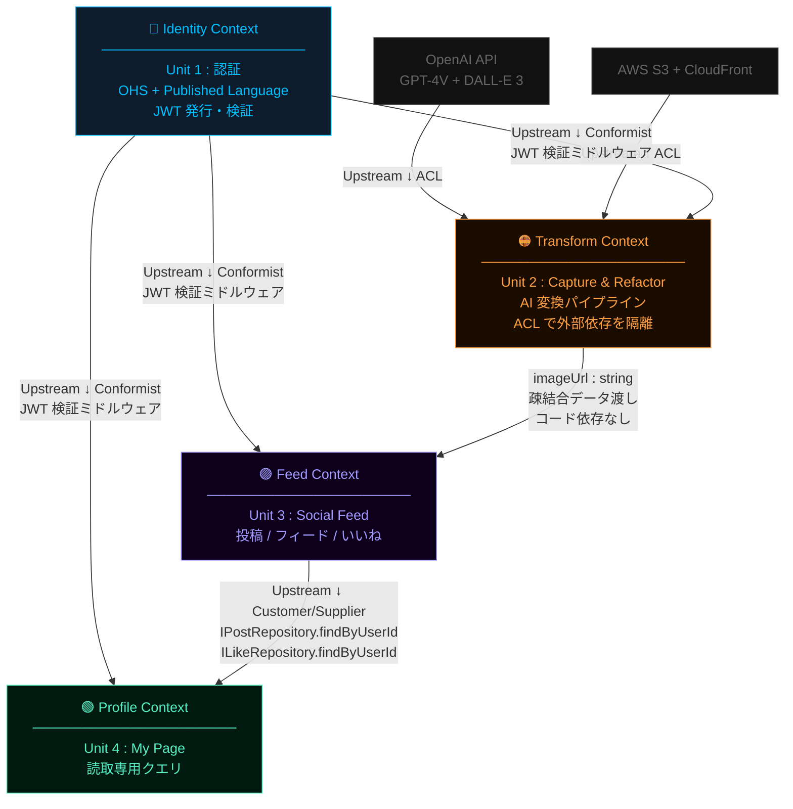
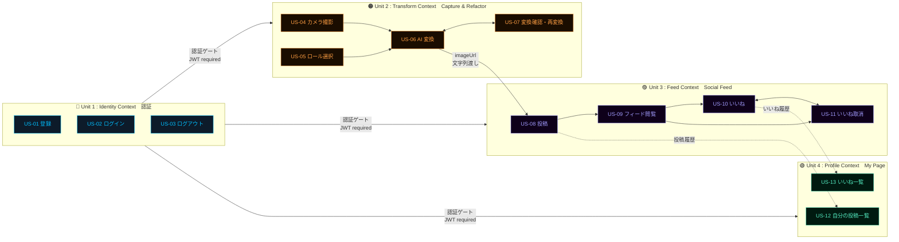
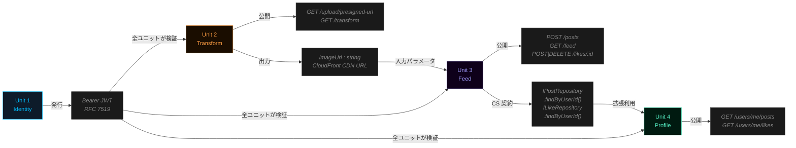
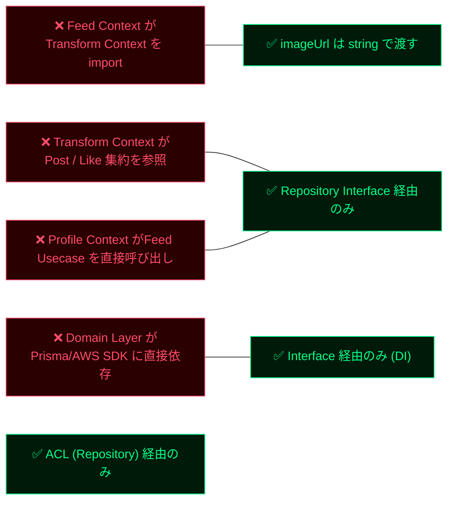

# Context Mapping — Refactor the World (RTW) MVP

---

## 図1: バウンデッドコンテキストマップ

各コンテキスト間の関係とDDDパターンを示す。

| パターン | 意味 |
|---------|------|
| **OHS + PL** | Identity が JWT という公開言語で全コンテキストに認証サービスを提供 |
| **Conformist** | Transform / Feed / Profile はJWTフォーマットをそのまま受け入れる |
| **ACL** | Transform が OpenAI / S3 のAPI変更からドメインを保護する |
| **Customer/Supplier** | Profile (顧客) が Feed (供給者) に追加クエリメソッドをリクエスト |
| **疎結合データ渡し** | Transform → Feed は imageUrl 文字列を渡すだけ。コードimportなし |

---

## 図2: ユーザーストーリー × コンテキストフロー

各USがどのコンテキストに属し、どの順序・依存で繋がるかを示す。

**凡例**:
- `→` = 実線: 実行時の直接依存（前のUSが完了しないと成立しない）
- `-.->` = 破線: データ参照（同一DBテーブルを読む。コード依存なし）
- `<->` = 双方向: 同一画面・同一フローで往復する操作

---

## 図3: ユニット間インターフェース契約

各ユニットが他ユニットに公開するインターフェースを示す。

---

## 禁止依存（境界ルール）

