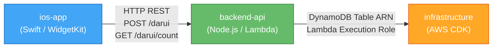

# ユニット依存関係 — Sloth-Lab

## 依存関係マトリクス

| ユニット | 依存先 | 依存タイプ | 依存の詳細 |
|---------|--------|-----------|-----------|
| `ios-app` | `backend-api` | ランタイム依存（HTTP）| API エンドポイント URL、リクエスト/レスポンス型 |
| `backend-api` | `infrastructure` | ランタイム依存（ARN）| DynamoDB テーブル名、Lambda 実行ロール |
| `infrastructure` | — | なし | 独立したユニット |

## 依存関係図



### テキスト代替

```
infrastructure  ← 依存なし（最初にデプロイ）
backend-api     ← infrastructure に依存（DynamoDB ARN / IAM Role）
ios-app         ← backend-api に依存（API エンドポイント URL）
```

## デプロイ順序

```
Step 1: cdk deploy (infrastructure)
  → DynamoDB Table: arn:aws:dynamodb:ap-northeast-1:xxxxx:table/darui-events
  → API Gateway URL: https://xxxx.execute-api.ap-northeast-1.amazonaws.com/prod

Step 2: backend-api Lambda deploy (CDK によって自動実行)
  → DaruiHandler Lambda が DynamoDB Table に接続
  → CountHandler Lambda が DynamoDB Table に接続

Step 3: iOS app build
  → SlothLabAPIClient.swift の baseURL に API Gateway URL を設定
  → Xcode でビルド → iOS Simulator / 実機でテスト
```

## API コントラクト（ユニット間の合意事項）

ios-app と backend-api の間で以下を事前合意する：

### POST /darui

**リクエスト:**
```json
{
  "lat": 35.6762,
  "lng": 139.6503,
  "deviceId": "550e8400-e29b-41d4-a716-446655440000"
}
```

**レスポンス:**
```json
{
  "count": 3
}
```

**HTTP Status:** 200 OK

### GET /darui/count

**クエリパラメータ:** `?lat=35.6762&lng=139.6503`

**レスポンス:**
```json
{
  "count": 3
}
```

**HTTP Status:** 200 OK

## 共有型定義（コード生成時に参照）

| 型 | iOS (Swift) | Backend (TypeScript) |
|----|------------|---------------------|
| リクエストボディ | `DaruiRequest: Codable` | `DaruiRequestBody` interface |
| レスポンス | `DaruiResponse: Codable` | `DaruiResponseBody` interface |
| カウントレスポンス | `CountResponse: Codable` | `CountResponseBody` interface |
