# Execution Plan — Sloth-Lab

## Detailed Analysis Summary

### Change Impact Assessment

| 影響領域 | 有無 | 内容 |
|---------|------|------|
| **ユーザー向けの変更** | Yes | iOS WidgetKit UI、タップインタラクション、近接人数表示、キャラクター増殖 |
| **構造的な変更** | Yes | 新規グリーンフィールド構築（iOS app + backend API + cloud infra）|
| **データモデルの変更** | Yes | DynamoDB 位置情報イベントスキーマ（新規）、TTL付き |
| **API の変更** | Yes | 新規 REST API エンドポイント（POST /darui、GET /darui/count）|
| **NFR への影響** | Yes | APIレイテンシ <3秒、WidgetKit更新タイミング、DynamoDB TTL 30分 |

### Risk Assessment

| 項目 | 評価 |
|------|------|
| **リスクレベル** | Medium |
| **理由** | 複数コンポーネント（iOS + Backend + Cloud）の新規構築。ハッカソン締め切り（5日）あり |
| **ロールバック難易度** | Easy（グリーンフィールドのためロールバック対象なし）|
| **テスト難易度** | Moderate（iOS Simulator + API + DynamoDB integration）|

---

## Workflow Visualization

```mermaid
flowchart TD
    Start(["ユーザーリクエスト"])

    subgraph INCEPTION["インセプション (INCEPTION PHASE)"]
        WD["ワークスペース検出<br/><b>COMPLETED</b>"]
        RE["リバースエンジニアリング<br/><b>SKIPPED</b>"]
        RA["要件分析<br/><b>COMPLETED</b>"]
        US["ユーザーストーリー<br/><b>COMPLETED</b>"]
        WP["ワークフロープランニング<br/><b>COMPLETED</b>"]
        AD["アプリケーション設計<br/><b>EXECUTE</b>"]
        UG["ユニット生成<br/><b>EXECUTE</b>"]
    end

    subgraph CONSTRUCTION["コンストラクション (CONSTRUCTION PHASE)"]
        FD["機能設計<br/><b>EXECUTE</b>"]
        NFRA["NFR要件<br/><b>EXECUTE</b>"]
        NFRD["NFR設計<br/><b>EXECUTE</b>"]
        INFRA["インフラ設計<br/><b>EXECUTE</b>"]
        CG["コード生成<br/>計画 + 生成<br/><b>EXECUTE</b>"]
        BT["ビルドとテスト<br/><b>EXECUTE</b>"]
    end

    subgraph OPERATIONS["オペレーションズ (OPERATIONS PHASE)"]
        OPS["オペレーションズ<br/><b>PLACEHOLDER</b>"]
    end

    Start --> WD
    WD --> RE
    RE --> RA
    RA --> US
    US --> WP
    WP --> AD
    AD --> UG
    UG --> FD
    FD --> NFRA
    NFRA --> NFRD
    NFRD --> INFRA
    INFRA --> CG
    CG --> BT
    BT --> OPS
    OPS --> Finish(["完了"])

style WD fill:#4CAF50,stroke:#1B5E20,stroke-width:3px,color:#fff
style RA fill:#4CAF50,stroke:#1B5E20,stroke-width:3px,color:#fff
style US fill:#4CAF50,stroke:#1B5E20,stroke-width:3px,color:#fff
style WP fill:#4CAF50,stroke:#1B5E20,stroke-width:3px,color:#fff
style CG fill:#4CAF50,stroke:#1B5E20,stroke-width:3px,color:#fff
style BT fill:#4CAF50,stroke:#1B5E20,stroke-width:3px,color:#fff
style RE fill:#BDBDBD,stroke:#424242,stroke-width:2px,stroke-dasharray: 5 5,color:#000
style AD fill:#FFA726,stroke:#E65100,stroke-width:3px,stroke-dasharray: 5 5,color:#000
style UG fill:#FFA726,stroke:#E65100,stroke-width:3px,stroke-dasharray: 5 5,color:#000
style FD fill:#FFA726,stroke:#E65100,stroke-width:3px,stroke-dasharray: 5 5,color:#000
style NFRA fill:#FFA726,stroke:#E65100,stroke-width:3px,stroke-dasharray: 5 5,color:#000
style NFRD fill:#FFA726,stroke:#E65100,stroke-width:3px,stroke-dasharray: 5 5,color:#000
style INFRA fill:#FFA726,stroke:#E65100,stroke-width:3px,stroke-dasharray: 5 5,color:#000
style OPS fill:#FFF59D,stroke:#F57F17,stroke-width:2px,stroke-dasharray: 5 5,color:#000
style Start fill:#CE93D8,stroke:#6A1B9A,stroke-width:3px,color:#000
style Finish fill:#CE93D8,stroke:#6A1B9A,stroke-width:3px,color:#000

linkStyle default stroke:#333,stroke-width:2px
```



### テキスト代替（ワークフロー）

```
インセプション・フェーズ (INCEPTION PHASE)
  ワークスペース検出         : COMPLETED ✅
  リバースエンジニアリング    : SKIPPED ⏭（グリーンフィールド）
  要件分析                  : COMPLETED ✅
  ユーザーストーリー         : COMPLETED ✅
  ワークフロープランニング    : COMPLETED ✅
  アプリケーション設計       : EXECUTE 🔄（次のステージ）
  ユニット生成              : EXECUTE 🔄

コンストラクション・フェーズ (CONSTRUCTION PHASE) ※ユニットごとに実行
  機能設計                  : EXECUTE 🔄
  NFR要件                   : EXECUTE 🔄
  NFR設計                   : EXECUTE 🔄
  インフラ設計              : EXECUTE 🔄
  コード生成                : EXECUTE 🔄
  ビルドとテスト             : EXECUTE 🔄

オペレーションズ・フェーズ (OPERATIONS PHASE)
  オペレーションズ           : PLACEHOLDER 📌
```

---

## Phases to Execute

### インセプション・フェーズ (INCEPTION PHASE)

- [x] ワークスペース検出 (Workspace Detection) — **COMPLETED**
- [x] リバースエンジニアリング (Reverse Engineering) — **SKIPPED**
  - **理由**: グリーンフィールドプロジェクト。既存コードなし。
- [x] 要件分析 (Requirements Analysis) — **COMPLETED**
- [x] ユーザーストーリー (User Stories) — **COMPLETED**
- [x] ワークフロープランニング (Workflow Planning) — **COMPLETED**（このステージ）
- [ ] アプリケーション設計 (Application Design) — **EXECUTE**
  - **理由**: iOS app / WidgetKit extension / Backend API の3つの新規コンポーネント構造・依存関係・ビジネスルールの定義が必要。
- [ ] ユニット生成 (Units Generation) — **EXECUTE**
  - **理由**: 新規DynamoDBスキーマ、新規APIエンドポイント（POST /darui, GET /darui/count）、iOS + Backend + Infra の複数パッケージ構成のため分解が必要。

### コンストラクション・フェーズ (CONSTRUCTION PHASE)（ユニットごとに実行）

- [ ] 機能設計 (Functional Design) — **EXECUTE**
  - **理由**: DynamoDB データモデル、近接クエリロジック（3km半径・30分TTL）、AppIntent 状態管理など新規ビジネスロジックが多い。
- [ ] NFR要件 (NFR Requirements) — **EXECUTE**
  - **理由**: APIレイテンシ要件（<3秒）、WidgetKit更新タイミング、DynamoDB スループット設計が必要。
- [ ] NFR設計 (NFR Design) — **EXECUTE**
  - **理由**: NFR要件を実行するため、対応するNFR設計も実行する。
- [ ] インフラ設計 (Infrastructure Design) — **EXECUTE**
  - **理由**: AWS リソース（DynamoDB, Lambda, API Gateway）の仕様策定と CDK スタック設計が必要。
- [ ] コード生成 (Code Generation) — **EXECUTE**（常時実行）
  - **理由**: 実装計画とコード生成が必要。
- [ ] ビルドとテスト (Build and Test) — **EXECUTE**（常時実行）
  - **理由**: ビルド・テスト・検証手順が必要。

### オペレーションズ・フェーズ (OPERATIONS PHASE)

- [ ] オペレーションズ (Operations) — **PLACEHOLDER**
  - **理由**: 将来のデプロイメントおよびモニタリングワークフローのプレースホルダー。

---

## 予定ユニット（ユニット生成ステージで確定）

| # | ユニット名 | 技術スタック | 概要 |
|---|-----------|------------|------|
| 1 | `backend-api` | Node.js / TypeScript / Lambda | POST /darui（位置情報受信）、GET /darui/count（近接カウント返却）|
| 2 | `ios-app` | Swift / WidgetKit / AppIntent | iOS アプリ本体 + WidgetKit Extension + 「だるい」AppIntent |
| 3 | `infrastructure` | AWS CDK | DynamoDB Table, Lambda Function, API Gateway, IAM Roles |

---

## 推定タイムライン

- **残日数**: 5日（締め切り: 2026-05-10）
- **優先ゴール**: ハッカソンデモ「ゴールデンパス」が動くPoCの完成
- **総ステージ数**: 12（完了済み5、スキップ1、実行予定6）

---

## Success Criteria

- **Primary Goal**: ハッカソンデモ「ゴールデンパス」が2台のiPhoneで動作すること
- **Key Deliverables**:
  - iOS WidgetKit アプリ（「だるい」ボタン + 近接人数表示 + キャラクター増殖）
  - Backend REST API（GPS受信・近接カウント返却）
  - DynamoDB スキーマ（TTL付き位置情報イベント保存）
  - AWS CDK でデプロイ可能なスタック
- **Quality Gates**:
  - iOS Simulator でウィジェットタップ動作確認
  - API エンドポイント疎通確認
  - 複数デバイスでの同時タップ → カウント増加 → キャラクター増殖確認
