# Execution Plan — Sloth Feed PoC

> **本ドキュメントの位置づけ（2026-05-09 更新・3回目サイクル検証済）**
> 1回目サイクル（2026-05-07）で初期化、2回目サイクル（2026-05-09）で Issue #5 帰着を反映、**3回目サイクル（2026-05-09・正式再構成）で再検証・修正**。
> 3回目サイクルの方針：**INCEPTION 完了で終了**（CONSTRUCTION Phase は将来判断後に着手）。
>
> **用語**：
> - **PoC** = INCEPTION + CONSTRUCTION（Web アプリとして動作するプロトタイプ）
> - **3回目サイクル提出版** = 本 PoC の **INCEPTION 部分**の inception 成果物（AI-DLC コンペに提出）
> - **Phase 2** = **PoC 完成後**の発展計画（S3 + Agentic Search、マルチモーダル、IP拡張等）。**PoC には含まれない**
>
> 関連：[`requirement-verification-questions.md`](../requirements/requirement-verification-questions.md)

---

## 詳細分析サマリー

### 変更影響評価

| 影響領域 | 有無 | 内容 |
|---------|------|------|
| ユーザー向けの変更 | Yes | 全機能がユーザー直接操作（投稿・フィード・AIコメント） |
| 構造的な変更 | Yes | 新規システム。Next.js + DynamoDB + **Amazon Bedrock 経由の Claude** の統合設計が必要 |
| データモデルの変更 | Yes | User・Post の新規設計（**`stamps` 削除・`aiCitationSource` 追加**）|
| API の変更 | Yes | auth / posts / feed / ai-comment の新規エンドポイント設計 |
| NFR への影響 | Yes | Bedrock Claude レスポンスタイム・DynamoDB 設計・JWT 認証・**AI 出力の倫理性（NFR-005）・ユーザーをファンとして遇する（NFR-006）** |
| **動的IP × AI 体験** | Yes | **5経路紐付け・人格「達観した怠惰の老師」・経路ラベル・サンドイッチUI・依存防止切り上げ提案・引用ソース戦略（PoC は LLM 信用 / Phase 2 は S3 Agentic Search）** |

### リスク評価

| 項目 | 評価 |
|------|------|
| **リスクレベル** | Medium |
| **ロールバック複雑性** | Moderate（AWS インフラと Bedrock Claude の依存関係あり） |
| **テスト複雑性** | Moderate（AI フィルタリング精度検証 + **5経路紐付けの妥当性 + 人格一貫性の人手検証**が必要） |
| **不確実性** | Bedrock Claude のフィルタリング精度（PoC レベルで許容）／**LLM の学習済み知識への依存によるハルシネーションリスク**（PoC で受容、Phase 2 で S3 Agentic Search による事実検証で解消） |
| **倫理性リスク** | 「ダメ礼賛が依存を生む」ダーク・パターン → **FR-009 依存防止機能で構造的に回避**（連続投稿5件 / 滞在30分で老師人格が「そろそろ寝ましょう」を提案）|
| **競合リスク** | コウペンちゃん等の既存「ダメ系IP」と類似と見られるリスク → **多層的差別化**で対応： **(コア4軸)** 「**仕事じゃないことを肯定する**」（怠惰系・善行系両方）vs コウペンの「褒める」／動的IP × AI vs 静的IP／思想的深さ（Larry Wall・ラッセル・老子等）／SNS統合（IP の本体） **(IP・人格資産)** ナマケモノキャラ × 「**達観した怠惰の老師**」人格 / パンチライン「**『仕事じゃないけど、、、』が世の中を変える**」 / **5経路フレーム** / **両タイプ受容**（怠惰でも善行でも） **(倫理・思想)** ファンとして遇する原則（toBデータ販売・広告・レポート販売なし）/ FR-009 依存防止切り上げ機能 / 引用ソース戦略（PoC は LLM 信用 / Phase 2 は S3 Agentic Search）|

---

## ワークフロー可視化

```mermaid
flowchart TD
    Start(["User Request"])

    subgraph INCEPTION["🔵 INCEPTION PHASE"]
        WD["Workspace Detection<br/><b>COMPLETED</b>"]
        RA["Requirements Analysis<br/><b>COMPLETED</b><br/>(3周検証済)"]
        US["User Stories<br/><b>COMPLETED</b><br/>(3周検証済)"]
        WP["Workflow Planning<br/><b>COMPLETED</b><br/>(3周再構成済)"]
        AD["Application Design<br/><b>COMPLETED</b><br/>(3周検証済 + Auth.js移行 + セキュリティ/バージョン管理レビュー)"]
        UG["Units Generation<br/><b>COMPLETED</b><br/>(3周検証済 + PR Review 12項目解消)"]
        S7["Stage 7: 完了処理<br/><b>COMPLETED</b><br/>(README 1ページ要約 + ピン留め)"]
    end

    subgraph CONSTRUCTION["🟢 CONSTRUCTION PHASE"]
        FD["Functional Design<br/><b>DEFERRED</b>"]
        NFRA["NFR Requirements<br/><b>DEFERRED</b>"]
        NFRD["NFR Design<br/><b>DEFERRED</b>"]
        ID["Infrastructure Design<br/><b>DEFERRED</b>"]
        CG["Code Generation<br/><b>DEFERRED</b>"]
        BT["Build and Test<br/><b>DEFERRED</b>"]
    end

    subgraph OPERATIONS["🟡 OPERATIONS PHASE"]
        OPS["Operations<br/><b>PLACEHOLDER</b>"]
    end

    Start --> WD
    WD --> RA
    RA --> US
    US --> WP
    WP --> AD
    AD --> UG
    UG --> S7
    S7 ==>|"3回目: ここで終了"| End_Inception(["INCEPTION 完了<br/>(コンペ提出版)"])
    S7 -.->|"将来計画"| FD
    FD --> NFRA
    NFRA --> NFRD
    NFRD --> ID
    ID --> CG
    CG --> BT
    BT -.-> OPS
    OPS -.-> End_Full(["全フェーズ完了"])

    style WD fill:#4CAF50,stroke:#1B5E20,stroke-width:3px,color:#fff
    style RA fill:#4CAF50,stroke:#1B5E20,stroke-width:3px,color:#fff
    style US fill:#4CAF50,stroke:#1B5E20,stroke-width:3px,color:#fff
    style WP fill:#4CAF50,stroke:#1B5E20,stroke-width:3px,color:#fff
    style AD fill:#4CAF50,stroke:#1B5E20,stroke-width:3px,color:#fff
    style UG fill:#4CAF50,stroke:#1B5E20,stroke-width:3px,color:#fff
    style S7 fill:#4CAF50,stroke:#1B5E20,stroke-width:3px,color:#fff
    style FD fill:#BDBDBD,stroke:#424242,stroke-width:2px,stroke-dasharray: 5 5,color:#000
    style NFRA fill:#BDBDBD,stroke:#424242,stroke-width:2px,stroke-dasharray: 5 5,color:#000
    style NFRD fill:#BDBDBD,stroke:#424242,stroke-width:2px,stroke-dasharray: 5 5,color:#000
    style ID fill:#BDBDBD,stroke:#424242,stroke-width:2px,stroke-dasharray: 5 5,color:#000
    style CG fill:#BDBDBD,stroke:#424242,stroke-width:2px,stroke-dasharray: 5 5,color:#000
    style BT fill:#BDBDBD,stroke:#424242,stroke-width:2px,stroke-dasharray: 5 5,color:#000
    style OPS fill:#FFF59D,stroke:#F9A825,stroke-width:2px,color:#000
    style Start fill:#CE93D8,stroke:#6A1B9A,stroke-width:3px,color:#000
    style End_Inception fill:#CE93D8,stroke:#6A1B9A,stroke-width:3px,color:#000
    style End_Full fill:#CE93D8,stroke:#6A1B9A,stroke-width:2px,stroke-dasharray: 5 5,color:#000

    linkStyle default stroke:#333,stroke-width:2px
```

**色凡例**：
- 🟢 緑（COMPLETED）：完了済ステージ（**3回目サイクル全 7 ステージが完了**）
- ⚫ グレー破線（DEFERRED）：3回目では保留・将来計画（CONSTRUCTION PHASE）
- 🟡 黄（PLACEHOLDER）：将来拡張用（OPERATIONS PHASE）
- 🟣 紫（Start/End）：ライフサイクルの境界

**「3回目: ここで終了」**：本 PoC のコンペ提出版は INCEPTION 完了（Stage 7 含む）で終了する方針。Construction Phase は将来判断後に着手する。

> ## 📌 CONSTRUCTION 着手時の必読事項
> Construction Phase に進む際は、以下 2 文書を**実装計画策定の前に必ず参照**：
> - **[security-review.md](../application-design/security-review.md)** — OWASP Top 10 観点・Code Review チェックリスト 11 項目
> - **[version-management-review.md](../application-design/version-management-review.md)** — 2024〜2025 インシデント対応・実装着手前に決定すべき 3 点（Next.js 14.2.25+/15.2.3+ 必須・AWS IAM ロール一本化・CI で `npm ci` + `npm audit`）+ ベースライン 13 項目

---

## 実行するフェーズ

### 🔵 INCEPTION PHASE

#### 1回目サイクル（2026-05-07）
- [x] Workspace Detection — COMPLETED
- [x] Reverse Engineering — SKIPPED（Greenfield）
- [x] Requirements Analysis — COMPLETED
- [x] User Stories — COMPLETED
- [x] Workflow Planning — COMPLETED（このファイル作成）
- [x] Application Design — COMPLETED
- [x] Units Generation — COMPLETED（4→3 ユニット統合確定）

#### 2回目サイクル（2026-05-09・Issue #5 帰着反映）
- [x] ideation 修正（Phase 1：customer_insights / ideas / commercialization / project-overview）
- [x] inception 再構築（requirements / user-stories / application-design / unit-of-work を IP事業 × 動的IP × 5経路 × 怠惰/善行両タイプ で再記述）
- [x] 不整合解消（mock 更新・stamps 削除・aiCitationSource 追加）

#### 3回目サイクル（2026-05-09・正式再構成・各ステージで人間レビュー）— **完了**
- [x] Stage 1: Workspace Detection
- [x] Stage 2: Requirements Analysis（Issue 1〜10 適用：用語整合・新FR-009/010/011・Bedrock 統一・RAG 除外/Phase 2 で S3 Agentic Search・人格「達観した怠惰の老師」確定）
- [x] Stage 3: User Stories（Issue 1〜7 適用：用語統一・経路ラベル・新US-009 切り上げ提案・人格制約反映）
- [x] Stage 4: Workflow Planning（本ドキュメント・3周再構成済）
- [x] Stage 5: Application Design（再検証 + Auth.js + Cognito 移行 10 文書カスケード更新）
- [x] Stage 6: Units Generation（再検証 + PR Review 12 項目解消）
- [x] Stage 7: 完了処理（README 1 ページ要約作成・CONSTRUCTION ピン留め・セキュリティ/バージョン管理レビュー補完）

### 🟢 CONSTRUCTION PHASE（**3回目サイクルでは保留・将来計画**）

本 PoC（AI-DLC コンペ提出版）は **inception 完了で終了**する方針。Construction Phase は将来計画として保留する。

- [ ] Functional Design — **DEFERRED（将来計画）**
- [ ] NFR Requirements — **DEFERRED（将来計画）**
- [ ] NFR Design — **DEFERRED（将来計画）**
- [ ] Infrastructure Design — **DEFERRED（将来計画）**
- [ ] Code Generation — **DEFERRED（将来計画）**
- [ ] Build and Test — **DEFERRED（将来計画）**

Construction Phase を実行する場合、各ステージでユーザー明示的承認が必要。`unit-of-work.md` の3ユニット構造に従い Unit 1 → 2 → 3 の順で実装を進める。

### 🟡 OPERATIONS PHASE
- [ ] Operations — PLACEHOLDER（将来のデプロイ・監視ワークフロー）

---

## ユニット分解（Units Generation で確定済・3ユニット）

> **変更経緯**：当初の execution-plan は 4ユニット構成だったが、Units Generation 時の `unit-of-work-plan.md` 質問1（B回答）で **Unit 2 + Unit 3 を統合**することが決定。最終的に **3ユニット**に確定（`unit-of-work.md` を参照）。

| Unit | 名称 | 意味的位置づけ（動的IP × AI技術文脈） | 主要構成要素 |
|------|------|-----|------|
| **Unit 1** | **Auth + IPファン識別基盤** | IP のファン識別装置。ユーザーは商品ではなくファンとして登録される | メール+パスワード登録・ログイン・JWT 発行・JWT 検証 middleware・DynamoDB Users テーブル・`lib/types/`・`lib/db/`・`lib/utils/` 共通基盤 |
| **Unit 2** | **ナマケモノ対話エンジン**（動的IPの核）| AI ナマケモノが「達観した怠惰の老師」人格でユーザーごとに個別化された肯定を返す | Bedrock Claude フィルタリング（怠惰系/善行系両方を通過）・5経路紐付け・LLM 学習済み知識からの引用生成・個別化記憶（FR-006）・人格 System Prompt（FR-010）・依存防止切り上げ提案（FR-009）・出典明記・サンドイッチUI 連携 |
| **Unit 3** | **共同体タイムライン（サンドイッチUI）**| ファン共同体の場。「みんな仕事じゃないことをやって生きている」を空間化 | タイムライン取得（未ログインで閲覧可）・自分の投稿一覧（JWT 必須）・サンドイッチUI（BrandFrame 上下「仕事じゃないけど」「これが世の中を変える」）・経路ラベル【経路X】表示（FR-011）|

**実行順序**: Unit 1（Auth + IPファン識別基盤）→ Unit 2（ナマケモノ対話エンジン）→ Unit 3（共同体タイムライン）

**ユニット間の依存**:
- Unit 2 / Unit 3 は Unit 1 の `lib/types/`・`lib/db/`・`lib/utils/`・`middleware.ts` に依存
- Unit 3 は Unit 2 の `PostRepository`・Posts テーブル・Posts スキーマ（`aiCitationSource` 含む）に依存

**Phase 2 構想**：Unit 2 に `lib/agents/`（S3 + Agentic Search）追加、引用検証パイプラインの実装（FR-007 参照）

---

## 成功基準

### Primary Goal

「仕事じゃないけど」を投稿（怠惰系・善行系問わず）→ Bedrock Claude フィルタリング → AI ナマケモノ（達観した怠惰の老師人格）が **5経路のいずれかに紐付けて偉人引用付きで肯定** → サンドイッチUI でタイムライン表示、の一連フローが動作する

### Key Deliverables

認証 / IPファン識別基盤 / 投稿 / AI フィルタリング / 5経路紐付けナマケモノ対話 / サンドイッチUI / 経路ラベル表示 / 個別化記憶 / 依存防止切り上げ提案 / タイムライン / 自分の投稿一覧

### Quality Gates（4セクション）

#### コアフロー
- 怠惰系投稿（例：「布団から3時間出られなかった」）が正しく通過する
- 善行系投稿（例：「彼に洗い物しといた」）も**等しく**正しく通過する
- 仕事の成果・旅行投稿が Bedrock Claude に正しく除外される
- DynamoDB への読み書きが正常に動作する
- JWT 認証が正常に動作する

#### 5経路 × ビジョン整合
- AI ナマケモノコメントが**5経路のいずれかに紐付けて**生成される（FR-003）
- AI ナマケモノコメントに偉人・科学・歴史の引用付き（PoC では LLM の自己申告）（FR-007）
- サンドイッチUI で「仕事じゃないけど…世の中を変える」が常に表示される（FR-008）
- 各投稿に経路ラベル（【経路X】）が表示される（FR-011）
- **ビジョン「『仕事じゃないけど、、、』が世の中を変える」**が UI を通じて伝わる

#### IPブランド・倫理性
- AI ナマケモノが「達観した怠惰の老師」人格で一貫している（FR-010）
- 投稿を拒絶しない・他ユーザーと比較しない・馴れ合い口調にしない
- 🦥 はヘッダラベルにのみ使用、本文には入れない
- 連続使用検知時に切り上げ提案が出る（FR-009）
- スタンプ機能が**存在しない**ことを確認（旧 stamps フィールド削除確認）
- **toBデータ販売・広告掲載・加工レポート販売をしない**（NFR-006）

#### インフラ
- AWS DynamoDB への読み書きが機能する
- Amazon Bedrock 経由の Claude 呼び出しが動作する（IAM 認証）

---

## Phase 2 構想（PoC 完成後の発展計画・**案・未合意**）

> ⚠️ **重要な注記：本セクションの内容は「案」であり、チーム内で十分な合意が取れていない**
>
> 以下に記載する技術的拡張・機能的拡張・IP事業拡張・売上目安はすべて**現時点の構想・たたき台**である。**正式な意思決定はされておらず**、Phase 2 着手時に改めて検討・合意形成・優先度付けが必要。3回目サイクルでは「将来このような選択肢があり得る」記録として残すことが目的。
>
> **用語スコープ**：
> - **PoC** = INCEPTION + CONSTRUCTION（Web アプリとして動作するプロトタイプ）。LLM の学習済み知識による引用ソース戦略を採用
> - **Phase 2** = **PoC 完成後**の発展計画。**S3 + Agentic Search による引用検証**等を含む
> - **3回目サイクル状態**：PoC のうち INCEPTION 部分のみ完了。CONSTRUCTION は DEFERRED（将来判断後に着手）
>
> 本セクションは PoC（INCEPTION + CONSTRUCTION）完成**後**の発展計画。`commercialization.md` の5レイヤー収益モデル・Year 1〜3 計画と整合する。**S3 + Agentic Search は Phase 2（= PoC 後）の構想であり、PoC（= CONSTRUCTION 完了時点）には含まれない**点を明示する。

### 技術的拡張（**案・未合意**）

| 領域 | 構想内容 | 関連 FR/NFR |
|---|---|---|
| **引用検証** | S3 + Agentic Search による事実検証パイプライン。LLM 学習済み知識依存からの脱却（ハルシネーション解消）| FR-007 |
| **マルチモーダル** | 画像生成（Bedrock 経由 Stable Diffusion / Imagen 等）でナマケモノの「今日のひとコマ」自動生成 | 新規 |
| **音声合成（TTS）** | ナマケモノが**声**を持つ。寝る前の罪悪感タイミングに囁く演出 | 新規 |
| **AR / 3D** | 部屋にナマケモノを召喚して一緒にダラダラする体験 | 新規 |
| **ライブタイムライン** | 「いま誰かもサボっている」アンビエント表示 | 新規 |
| **個別化深化** | キャラクターの「成長」演出。ユーザーが長く使うとナマケモノが進化する | FR-006 |
| **マルチリージョン対応** | Bedrock リージョン障害時のフェイルオーバー | NFR-007 |

### 機能的拡張（FR-012〜014 据え置き候補から）（**案・未合意**）

| 候補 | 内容 | 採用判断 |
|---|---|---|
| FR-012 | アカウント削除・データエクスポート機能 | Phase 2 採用候補（NFR-006 担保のため）|
| FR-013 | 自分の経路分布の統計・自分史 | Phase 2 採用候補（FR-011 経路ラベルが前提として動作後）|
| FR-014 | 通報機能（最小限） | リリース前必須・Phase 2 早期採用 |

### IP事業拡張（commercialization.md と連動）（**案・未合意**）

> ⚠️ 以下の期間・売上目安は**未合意の試算**。実際の事業計画はチーム内で別途合意形成のうえ確定する。

| 期間 | フェーズ | 重点活動 | 売上目安（試算）|
|---|---|---|---|
| **Year 1** | キャラ・思想立ち上げ | SNS発信、コアファン育成、初期グッズ | 3,000万-5,000万円（**未合意**）|
| **Year 2** | 認知拡大・物販本格化 | 雑貨展開、書籍出版、初期コラボ | 2-3億円（**未合意**）|
| **Year 3** | 文化化・ライセンス本格化 | アニメ化、大型コラボ、海外展開検討 | 5-10億円（**未合意**）|

### 不採用方針（**確定事項・Issue #5 で合意済**）

> ✅ 以下は **3回目サイクルで確定した方針**であり、Phase 2 でも維持する。

| 項目 | 理由 |
|---|---|
| toBデータ販売 | Issue #5 で確定・思想商品としての一貫性を破壊 |
| 加工レポート販売（Spotify Wrapped 型）| 同上（ロンダリング構造のため）|
| 広告掲載 | 同上 |
| ランキング・いいね・フォロワー数表示 | 比較・承認構造を生むため、ブランド設計レベルで禁止 |
