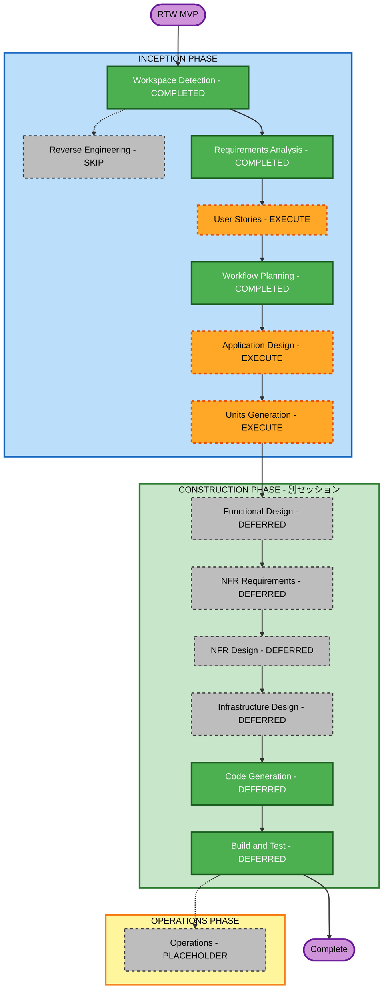

# Execution Plan — Refactor the World (RTW) MVP

## 詳細分析サマリー

### 変更影響評価
- **ユーザー向けの変更**: Yes — 全機能が新規（カメラ・AI変換・フィード・認証）
- **構造的な変更**: Yes — 全アーキテクチャが新規
- **データモデルの変更**: Yes — users / posts / likes スキーマが新規
- **APIの変更**: Yes — 全エンドポイントが新規
- **NFR影響**: Yes — AI変換パフォーマンス（10秒以内）・フィード表示（3秒以内）

### リスク評価
- **リスクレベル**: 中（Medium）
- **主なリスク要因**: 外部AI API（OpenAI）への依存、iOSビルド環境の要件
- **ロールバック複雑度**: 容易（全部新規のため既存影響なし）
- **テスト複雑度**: 中（AI変換の出力は非決定的なためテスト設計に工夫が必要）

---

## ワークフロー可視化



### テキスト代替（フォールバック）
```
INCEPTION PHASE
  [✅] Workspace Detection   — COMPLETED
  [⏭] Reverse Engineering   — SKIP (Greenfield)
  [✅] Requirements Analysis — COMPLETED
  [▶] User Stories          — EXECUTE
  [✅] Workflow Planning     — COMPLETED
  [▶] Application Design    — EXECUTE
  [▶] Units Generation      — EXECUTE

CONSTRUCTION PHASE (別セッション)
  [⏸] Functional Design     — DEFERRED
  [⏸] NFR Requirements      — DEFERRED
  [⏸] NFR Design            — DEFERRED
  [⏸] Infrastructure Design — DEFERRED
  [⏸] Code Generation       — DEFERRED
  [⏸] Build and Test        — DEFERRED

OPERATIONS PHASE
  [⏸] Operations            — PLACEHOLDER
```

---

## 実行フェーズ一覧

### INCEPTION PHASE
- [x] Workspace Detection — COMPLETED
- [x] Reverse Engineering — SKIP（Greenfield のため）
- [x] Requirements Analysis — COMPLETED
- [ ] User Stories — **EXECUTE**
  - 理由：複数ペルソナ（ペルソナA/B）、新規UX全般、受け入れ基準が必要
- [x] Workflow Planning — COMPLETED（現在）
- [ ] Application Design — **EXECUTE**
  - 理由：認証・AI変換・投稿・フィードの全コンポーネントを新規設計
- [ ] Units Generation — **EXECUTE**
  - 理由：モバイル / バックエンドAPI / AI統合 / AWSインフラの4ユニット分割が必要

### CONSTRUCTION PHASE — 別セッションで実施
- [ ] Functional Design — 別セッション
- [ ] NFR Requirements — 別セッション
- [ ] NFR Design — 別セッション
- [ ] Infrastructure Design — 別セッション
- [ ] Code Generation — 別セッション
- [ ] Build and Test — 別セッション

### OPERATIONS PHASE
- [ ] Operations — PLACEHOLDER（将来のデプロイ・モニタリング）

---

## 想定ユニット構成（Units Generation で確定）

| # | ユニット名 | 内容 |
|---|-----------|------|
| 1 | Backend API | Node.js/TypeScript — 認証・投稿・ユーザーAPI |
| 2 | AI Integration Service | GPT-4V + DALL-E 3 変換パイプライン |
| 3 | Mobile App | React Native（iOS）— 全画面UI |
| 4 | AWS Infrastructure | S3 / RDS / Lambda / CloudFront 構成 |

---

## 成功基準

- **Primary Goal**: カメラで写真を撮る → AI変換 → RTWフィードに投稿・閲覧・いいねができる
- **Key Deliverables**: React NativeアプリのiOSビルド、Node.js APIサーバー、PostgreSQL DB、AI変換パイプライン
- **Quality Gates**:
  - AI変換レスポンス 10秒以内
  - フィード初回表示 3秒以内
  - AI変換バリデーション関数にPBT適用（部分）
